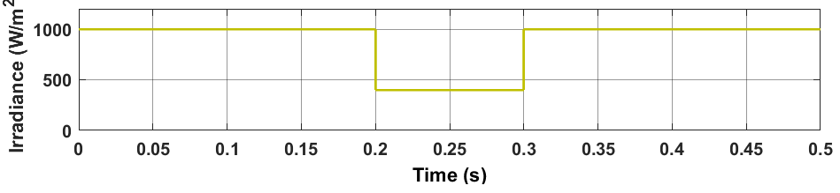
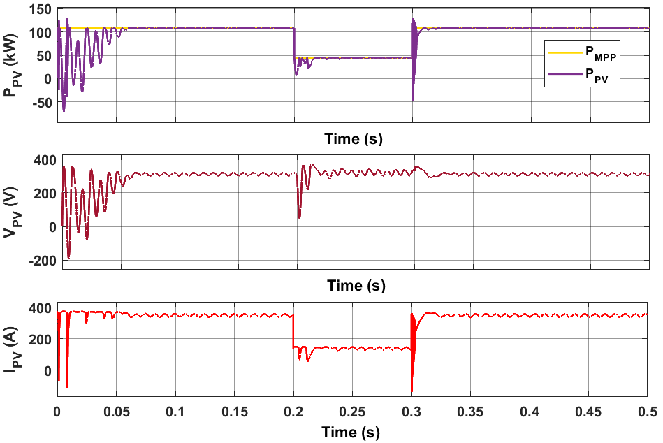
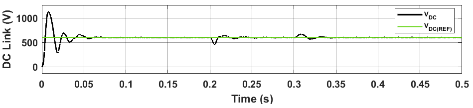
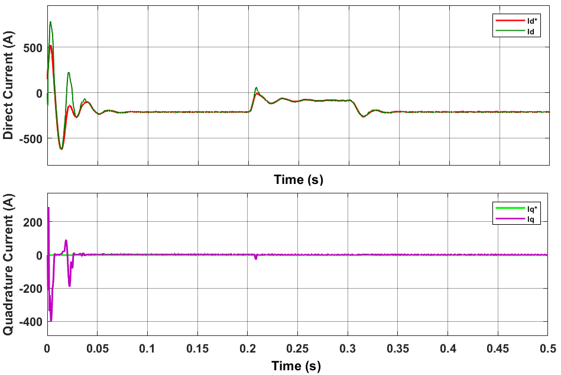
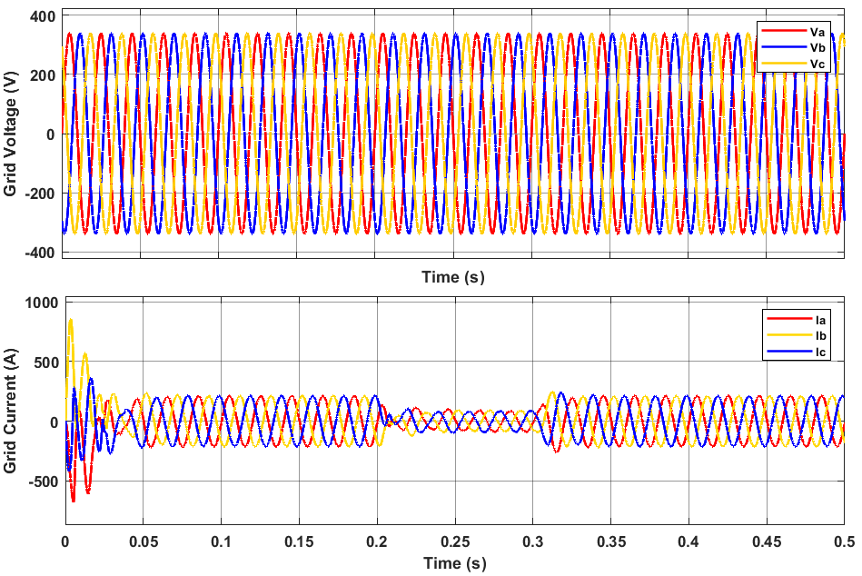
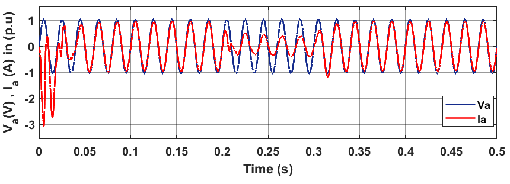
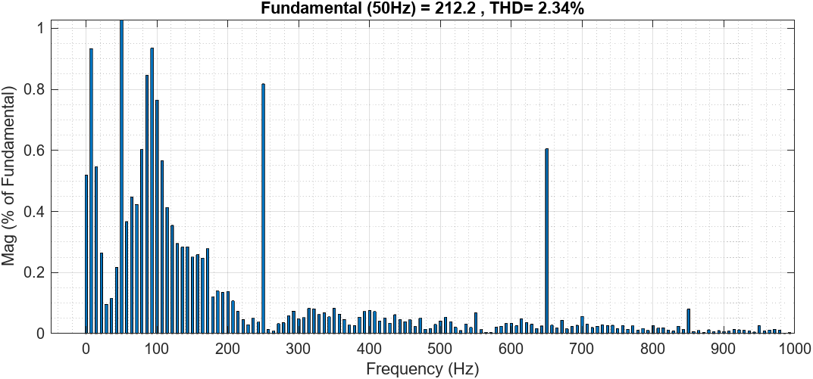

# Three-Phase-Grid-Connected-Inverter-Control-for-Photovoltaic-Systems_MATLAB-Simulink
A MATLAB/Simulink model of a 108 kW two-stage grid-connected PV system featuring MPPT (P&amp;O), dq-control, SPWM, and an LCL filter.

## Overview
This project presents modeling, simulation and control of a 108 kW two-stage grid-connected photovoltaic (PV) system using MATLAB/Simulink. The system integrates a DC-DC boost converter with a Perturb and Observe (P&O) Maximum Power Point Tracking (MPPT) algorithm, a three-phase Voltage Source Inverter (VSI), and an LCL filter for grid synchronization and harmonic attenuation.

The goal of this project is to ensure efficient and stable grid integration of solar power, providing high-quality sinusoidal current with minimal harmonic distortion. The system uses a current control technique in the dq reference frame for regulating active and reactive power, ensuring unity power factor operation.

## Components
### PV Array Model(REC Solar REC215PE modules):
A single-diode equivalent model of a PV cell is used to model the array's I-V characteristics.
- PV Module: REC Solar REC215PE-BLK
- Modules in Series: 11
- Modules in Parallel: 46
- Rated Power: 215.08 W per module
- Total Power Rating: 108.8 kW (46 modules × 11 series × 215.08 W)

### DC-DC Boost Converter with P&O MPPT Algorithm
The DC-DC boost converter is responsible for stepping up the voltage from the PV array to a higher level (600 V), suitable for the inverter.
The relationship between the input and output voltages in a boost converter is given by: $V_{out} = \frac{V_{in}}{1 - D}$

The P&O MPPT algorithm continuously adjusts the duty cycle based on the change in power and voltage.

$$
P(t) = V(t) I(t)
$$

$$
\begin{aligned}
\Delta P &= P(t) - P(t-1),\\
\Delta V &= V(t) - V(t-1)
\end{aligned}
$$

The algorithm perturbs (changes) the duty cycle and observes the resulting change in output power:

- If $\Delta P > 0$ and $\Delta V > 0$: **increase** the duty cycle.  
- If $\Delta P > 0$ and $\Delta V < 0$: **decrease** the duty cycle.  
- If $\Delta P < 0$ and $\Delta V > 0$: **decrease** the duty cycle.  
- If $\Delta P < 0$ and $\Delta V < 0$: **increase** the duty cycle.
- 
This process repeats iteratively to ensure the operating point converges to the Maximum Power Point (MPP).
​Where:
- $P(t)$ and $V(t)$ are the current power and voltage, and  
- $P(t-1)$ and $V(t-1)$ are the previous values.​

### Three-Phase VSI with dq-Control and PLL
The VSI (Voltage Source Inverter) is used to convert the DC voltage to three-phase AC voltage. The control of the inverter’s current is performed in the dq reference frame for independent control of active and reactive power.

#### Current Control in dq Frame

In the dq reference frame:
- **Active power (P)** is controlled by the **d-axis current ($i_d$)**  
- **Reactive power (Q)** is controlled by the **q-axis current ($i_q$)**

The relationships are defined as:

$$
i_d = \frac{P}{V_{dc}}, \quad i_q = 0 \quad (\text{for unity power factor})
$$

Where:
- $i_d$ : Direct-axis current regulating **active power**  
- $i_q$ : Quadrature-axis current regulating **reactive power** (set to zero for unity power factor)

#### Phase-Locked Loop (PLL) Algorithm

The **PLL** synchronizes the inverter with the **grid voltage** by tracking its **phase angle**.

$$
\theta = \int (\omega_{\text{grid}} \. dt)
$$

Where:
- $\omega_{\text{grid}}$ : Grid angular frequency  
- $\theta$ : Estimated phase angle of the grid voltage  

At the **Point of Common Coupling (PCC)**, the grid voltage is measured, and the PLL ensures proper synchronization between the inverter output and the grid.

#### Current Loop Control

The **current loop control** regulates the inverter’s output current to follow the reference current.  
It adjusts the inverter output voltage such that:
- The **d-axis current** controls **active power**
- The **q-axis current** controls **reactive power**

This ensures proper power exchange and synchronization with the grid’s voltage and frequency.

### LCL Output Filter
An **LCL filter** is implemented to attenuate high-frequency harmonics generated by the inverter’s PWM switching.  
The resonance frequency of the filter is given by:

$$
f_{\text{res}} = \frac{1}{2\pi\sqrt{L_1 L_2 C_f}}
$$

Where:

- $f_{\text{res}}$ : Resonance frequency of the filter  
- $L_1, L_2$ : Inductances of the filter  
- $C_f$ : Capacitance of the filter  

The LCL filter ensures compliance with grid harmonic standards and enhances the power quality injected into the grid.

## Results
### Irradiation Profile

A step-change irradiance profile (varying from 1000 W/m² down to 400 W/m², and then returning to 1000 W/m²) is used to test the controller across multiple operating points.

### PV array Power, Voltage and Current outputs for the given irradiation profile.

The resulting power, voltage, and current responses are shown. The implemented P&O MPPT algorithm successfully tracked the MPP within a short response time, maintaining stable operation with minimal oscillations. As expected from the PV (I–V) and (P–V) characteristics, the array current varied significantly with irradiance changes, while the voltage remained relatively stable.
### DC Link Voltage.

The DC-link voltage is maintained at its 600 V reference with minimal deviation during large changes in available power, demonstrating effective regulation.
### The direct and quadrature currents of the injected current.

The d-axis current ($I_d$) tracks the active power demand while the q-axis current ($I_q$) is regulated to zero, confirming decoupled control and unity power factor operation.
### Three phase grid voltage and grid current waveform at PCC.

The plots of three-phase voltages and currents at the PCC show that the grid voltages remain constant and sinusoidal, unaffected by irradiance variations, as expected from the stiff grid model. The current magnitude adjusts dynamically in proportion to the PV power available, showing coordination between the MPPT, DC-link regulation, and current controller. The PLL ensures alignment (i.e., keeping V_q = 0), which was a prerequisite for the independent P/Q control wanted, a unity PF. 
### Dynamic response of phase current and phase voltage.

The phase current is perfectly in-phase with the grid voltage, indicating the unity power factor operation achieved by the control system.
### Total Harmonic Distortion of grid current at the PCC.

The harmonic spectrum shows a THD of 2.34%, which is dominated by low-order switching harmonics and is well within the IEEE-519 standard limit of 5%.

## Getting Started
### Requirements:

MATLAB (preferably R2023a or later) and Simulink.
Simscape Electrical for modeling power electronics components.

### Steps to run the simulation
Simulink Control Design for controller tuning.
1. Clone this repository.
2. Open the main `.slx` file in MATLAB/Simulink (Requires Simscape Electrical).
3. Run the simulation.

---

*This model was developed as part of an academic internship project.*
